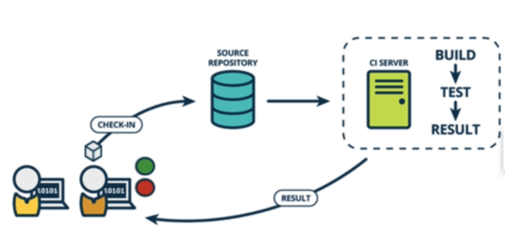
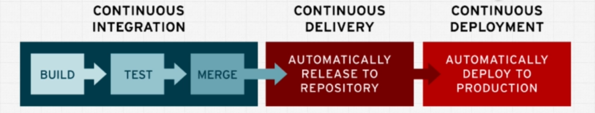
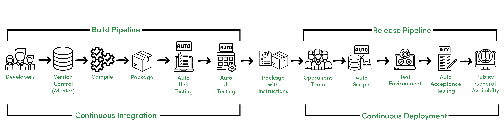

## CI - CD 

### CI (Continuour Integration)
   

- formal definition
    - Continuous integration (CI) is the practice of automating the integration of code changes from multiple contributors into a single software project. It’s a primary DevOps best practice, allowing developers to frequently merge code changes into a central repository where builds and tests then run. Automated tools are used to assert the new code’s correctness before integration.

    

- its a software developer best practice. with CI we would continuously take any new code that we've written on our mmachines and we would integrate that code into the main code that's been shared with everyone to make sure that our changes work ( for everyone on the team ). 
    - if we are using git to share our code with everone else, maybe on a service like github, what this would mean is merging our code continuously into the main branch and making sure that it still works
    - therefore one of the main ideas behind continuous integration is frequently committing code to a shared repository.
    - each of our developer will spend their day making small changes and checking them locally and then checking them into a source repository, something like github. (he knows it works on his machine, but there's no guarantee that it will work on another developers machine or on a actual server that is going to host the code)
    - to make sure that the code in the source repo works for everyone and not just on one machine we need a server. this server will detect when the code has been updated in the source repository and will then take that code and build it if necessary, will run any test, any automated unit or API tests and will then take the result and report back to the development team - they'll get the red lights(test failed or something went wrong, so the developer needs to fix those changes and re-commit them) or the green lights. 
    - we can add more checks into our CI server like linter checks to check if the formatting is done correctly and follows the guidlines of the project.
    - CI pipelines - checks that are required for our code to pass before they're accepted by our C.I. server, before we can merge them in and see that we've done our work.

- Tools and services to create these CI pipelines
    - circleci
    - travis-ci
    - Github Actions
    - Jenkins

### CD ( Continuous Delivery )

- Continuous delivery is a process that builds on continuous integration, it gives confidence that your code will work in production that your code is in a state that could be released to your users at any point in time. it involves user interaction testing and making sure that both the frontend and backend works well with eachother and making sure that overall system works and is ready for deployment.

    

- another CD ( continuous deployment ) - it takes continuous delivery and automate it, so you're contnuously deploying your code to production. note that continuous deployment isn't for every product, sometimes this really great thing doesn't actually make sense for what you are building.
- continuous deployement is a process which we use to deploy our software. it builds of the idea of continuous integration and continuous delivery to automatically deploy your code to production.
- but with continuous delivery you don't have to deploy that code to production until you choose to. the actual deployment step is manual.

### CI/CD pipeline

- Most software releases go through a couple of typical stages
    

- Source stage
    - In most cases, a pipeline run is triggered by a source code repository(when some developer pushes the code to repo). A change in code triggers a notification to the CI/CD tool, which runs the corresponding pipeline.
- Build stage
    - We combine the source code and its dependencies to build a runnable instance of our product that we can potentially ship to our end users. Programs written in languages such as Java, C/C++, or Go need to be compiled, whereas Ruby, Python and JavaScript programs work without this step.
    - Regardless of the language, cloud-native software is typically deployed with Docker, in which case the CI_CD server builds a docker container.
- Test stage
    - In this phase, we run automated tests to validate our code’s correctness and the behavior of our product.
        - unit test - checks each function/component or unit of the software
        - integration test - checks if those units works with eachother as they should.
        - smoke test - perform quick sanity checks to end-to-end integration tests that test the entire system from the user’s point of view.
- Deploy stage
    - Once we have a built a runnable instance of our code that has passed all predefined tests, we’re ready to deploy it. There are usually multiple deploy environments, for example, a “beta” or “staging” environment which is used internally by the product team, and a “production” environment for end-users.

    - based on the need only the staging/beta-relese can be autommated keeping the production release manual or the whole stage can be automated or kept manual.
    

### references
- [ci-cd](https://www.geeksforgeeks.org/ci-cd-continuous-integration-and-continuous-delivery/)
- [ci-cd pipeline article](https://semaphoreci.com/blog/cicd-pipeline)
